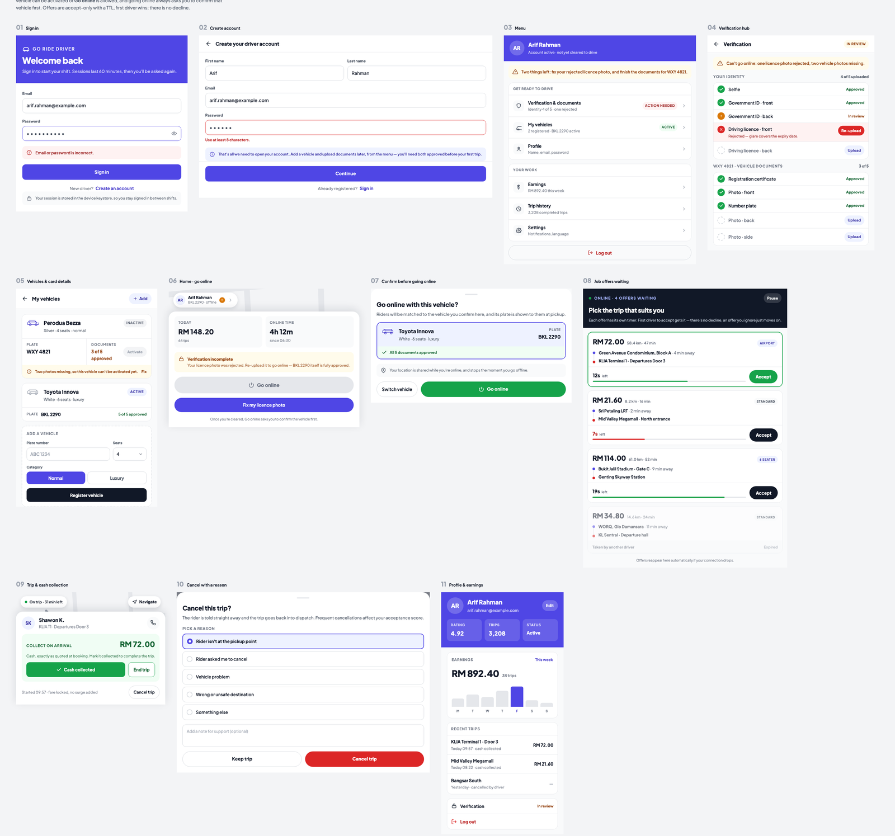
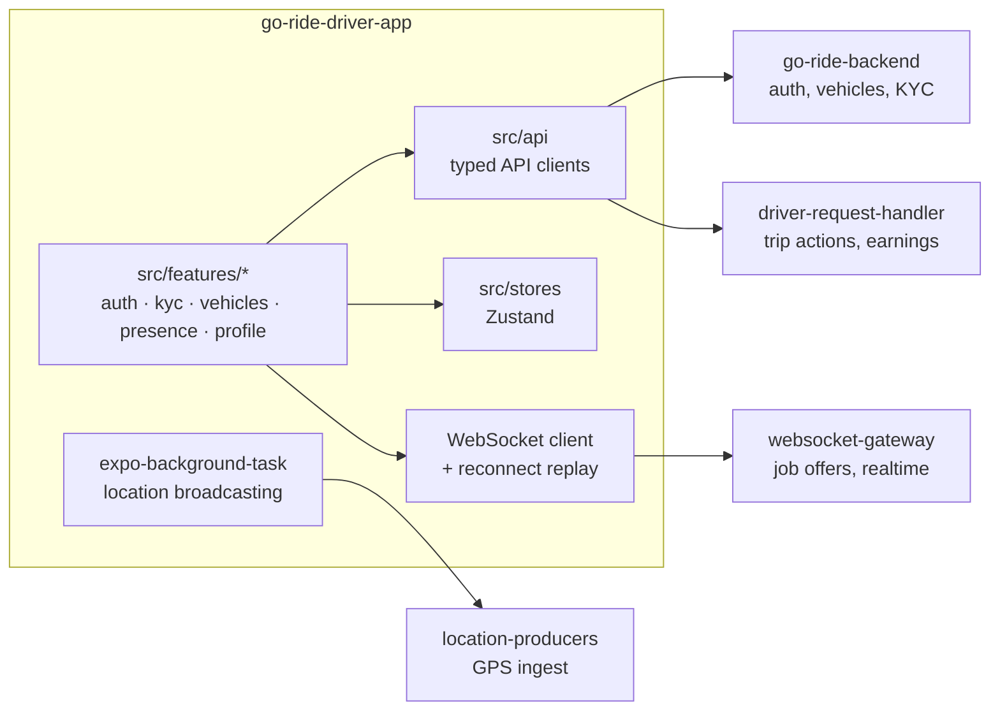

# Go Ride — Driver App

The driver-facing mobile app for **Go Ride**, a ride-hailing platform. Built with Expo/React Native, it takes a driver from signup through a two-track KYC verification, vehicle registration, going online, receiving realtime job offers over a WebSocket connection, accepting one under a ~15-second TTL (first-wins, no decline), and running the trip through to cash collection.

It talks to three backend services: **[go-ride-backend](https://github.com/shawon-kanji/go-ride-backend)** (auth, profile, vehicles, KYC), and **[go-ride-kafka-consumers](https://github.com/shawon-kanji/go-ride-kafka-consumers)**'s `driver-request-handler` (trip actions) and `websocket-gateway` (job offers, realtime).

<p align="center">
  
  
  
  
  
  
</p>

## Screens

Sign in/up → menu → two-track KYC verification → vehicle fleet → go online (with a confirmation gate) → realtime job offers → trip & cash collection → cancellation → profile & earnings.



## What it does

- **Auth & onboarding** — signup is deliberately account-only; vehicle registration and document upload are separate steps reached from the menu, not bundled into signup.
- **Two-track KYC** — driver identity (5 documents) and per-vehicle documents (5 per vehicle) are independent verification tracks. Both must clear before that vehicle can be activated or the driver can go online — the backend returns `403 KYC_NOT_APPROVED` / `403 VEHICLE_NOT_VERIFIED` and this app surfaces *which* one failed, never a raw 403.
- **Vehicle fleet** — register multiple vehicles; only one may be active, and an unverified vehicle is never selectable, gated in the UI itself rather than only by the server response.
- **Going online always confirms** — a driver never flips a bare toggle; going online routes through a confirmation screen naming the active vehicle, or to vehicle selection if none is active yet.
- **Realtime job offers** — accept-only, first-wins, per-offer TTL. There's no decline action because the backend has no reject endpoint. Offers replay automatically on WebSocket reconnect (no polling fallback exists for offers specifically — reconnect replay is the only reconciliation path) and arrive as notification-type FCM pushes so they survive Android killing the app.
- **Trip execution** — PIN-verified start, navigate, cash collection at arrival, cancellation with a required reason.

## Architecture



Full backend API contracts (auth, `driver-request-handler`, `/ws/driver`, `location-producers`) were mapped directly from backend source and cross-checked against the kafka-consumers realtime docs — no OpenAPI/Postman spec exists anywhere, so the TypeScript API types here are hand-maintained mirrors of the Go DTOs.

## Tech stack

| Layer | Choice |
|---|---|
| Framework | Expo SDK 57, custom dev client (not Expo Go), React Native 0.86, React 19 |
| Language | TypeScript, strict mode |
| Routing | Expo Router (file-based) |
| Styling | NativeWind (Tailwind for React Native) |
| State | Zustand |
| Server state | TanStack Query |
| Forms | React Hook Form + Zod |
| Maps & location | `react-native-maps`, `expo-location`, `expo-background-task` |
| Push notifications | `expo-notifications` (notification-type FCM, required to survive backgrounding) |
| Error tracking | Sentry |
| Testing | Jest + React Native Testing Library |

## Getting started

```bash
cp .env.example .env
npm install
npm start          # expo start
npm run android
npm test
```

Requires a Google Maps API key (Maps SDK, Places, Routes) restricted to the app's package + SHA-1, and the sibling backend services running (`go-ride-backend`, `go-ride-kafka-consumers`, via `go-ride-infra`'s local stack).

## Product scope, honestly

Android-first by constraint (no iOS device available, not a platform decision) — the codebase stays cross-platform via Expo defaults, but no iOS-specific setup happens yet. Cash-only payments and email/password auth match the backend exactly rather than anticipating features it doesn't have. Decline/reject-offer UX is deferred until the backend has a reject endpoint to back it.

## Design system

A deliberately bold, non-generic visual identity (indigo primary, Plus Jakarta Sans, line icons only) — a stated product requirement, not a default template look. Shares its theme tokens and generic component set (`Button`, `Card`, `Badge`, `TextInput`, `Select`, `Stepper`, `Banner`, `ConfirmDialog`, `EmptyState`) with the sibling rider app.
